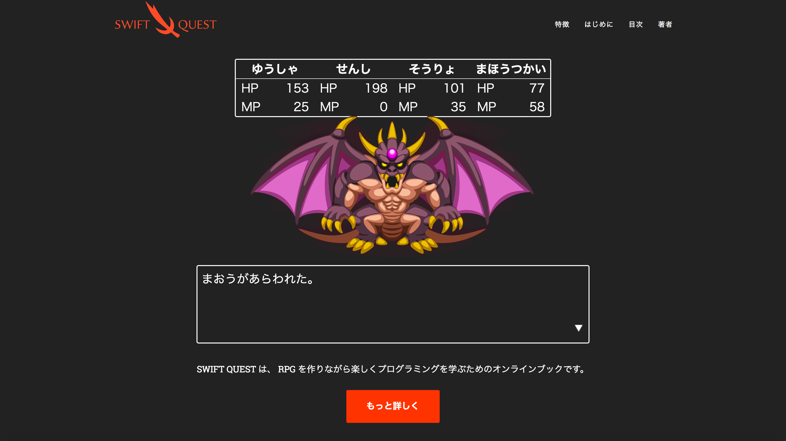

# Swiftの値型を極める × SWIFT QUEST

Swift は値型を中心とした言語です。 Swift を使いこなすには値型を使いこなすことが重要です。本コースでは、 RPG を題材として実際にコードを書くことで、値型の使い方を習得することを目指します。

## 参照型と値型と Swift

C# など値型を扱える言語は数多くありますが、値型だけでコードが書ける言語はめずらしいです。それは、大抵の言語ではコレクションが参照型だからです。

たとえば、 Python のリストは次のような挙動を示します。

```python
# Python
a = [2, 3, 4]
b = a
a[2] = 5

print(a)  # [2, 3, 5]
print(b)  # [2, 3, 5]
```

似たようなことを Swift でやると次のようになります。

```swift
// Swift
var a = [2, 3, 4]
var b = a
a[2] = 5

print(a) // [2, 3, 5]
print(b) // [2, 3, 4]
```

`b` の最後の要素が `4` のままであることに注意して下さい。 Swift の `Array` は参照型ではなく値型なので、 `a` と `b` はインスタンスを共有しません。そのため、 `a` に変更を加えても `b` には影響を与えないわけです。

コレクションはその仕組上、参照型である方が自然ですが、 Swift のコレクションは copy-on-write という仕組みを使って値型のコレクションを実現しています。

コレクションなしでコードを書くのは難しいですが、 Swift ではコレクションも値型なことによって、すべてのコードを値型で書くことすら可能です。実際、 Swift の標準ライブラリに存在する型は、一部の例外を覗いてすべて値型です。おそらく、ぱっと思い浮かぶような型はすべて値型だと思います。たとえば、次の型はすべて値型です。

```swift
struct Int { ... }
struct Double { ... }
struct Bool { ... }
struct String { ... }
struct Array<Element> { ... }
struct Dictionary<Key, Value> { ... }
enum Optional<Wrapped> { ... }
```

値型には、インスタンスが共有されないという特徴があります。これは、コードの挙動を明確にする上で利点となります。

たとえば、次のコードを実行すると何が起こるでしょうか？

```java
// Java
List<User> members = group.getMembers();
members.add(newMember);
```

この処理は `group` に影響を与えるでしょうか？もう一度 `getMembers` を呼び出すと、得られる結果に `newMember` は含まれているでしょうか？

もし `group` が内部に保持している `members` をただ `return` しているだけならそこに `newMember` も加えられますし、防御的コピーを行って `return` していると `group` には影響を与えません。問題は、そのことを型として表せないことです。ドキュメントに記すことはできますが、ドキュメントが最新に保たれているとは限りません。

仮に、「このプロジェクトでは必ず防御的コピーをすること」と決めていたとしても、一つの漏れもなく正しく実装されていると確信できるでしょうか。実際のプロダクトのコードでは、当初の方針から外れたその場しのぎのコードのつなぎ合わせになっているということが往々にして起こり得ます。そんなときに、数十、数百の型が存在し、ネストしたときに、その挙動に自信が持てるでしょうか。

そんなときに、イミュータブルクラスは一つの解です。しかし、イミュータブルクラスは状態を変更しようとしたときにインスタンスを再生成する必要があり、ミュータブルクラスと比べて冗長なコードになりがちです。値型を使えば、イミュータブルクラスのように、共有インスタンス経由で想定外に状態が変更されることを防止しながら、ミュータブルクラスのように簡単に状態を変更できます。本コースでは、同じ内容のプログラムをミュータブルクラス、イミュータブルクラス、値型と書き比べてみることを通して値型の利点を学びます。

また、シンプルなケースでは値型はミュータブルクラスのように簡単に状態を変更できますが、複雑なケースではテクニックが必要です。シンプルなケースから始めて、順番に複雑なケースでの値型の扱い方を学びます。

## RPG とプログラミング

僕は RPG を作りたくて小学 4 年生のときにプログラミングを始めました。当時意識していたわけではないですが、今振り返ると RPG を作るというのはプログラミングのトレーニングとしてとても優れていたと思います。

RPG の、特に戦闘にはプログラミングの要素が詰まっています。たとえば、 HP や最大 HP を表すには変数や定数を使います。

```swift
let maxHP = 153 // 最大HP
var hp = maxHP  // 現在HP
```

ダメージを計算するには四則演算が必要です。

```swift
// (攻撃力 - 防御力) ÷ 2 でダメージを計算する場合
let damage = (character.attack - target.defense) / 2
print("\(character.name)のこうげき。")
print("\(target.name)に\(damage)のダメージ！")
```

魔法で HP を回復したときに最大 HP を超えて回復しないようにするのは条件分岐です。


```swift
hp += 80

// 最大HPを超えて回復しないようにする
if hp > maxHP {
  hp = maxHP
}
```

キャラクターの配列でパーティを表し、ループで順番にキャラクターを取り出してオペレーションを実行する必要があります。


```swift
// キャラクターの配列でパーティを表す
var party: [Character] = [...]

// ループでパーティのキャラクターを順番に取得
for character in party {
    print(character.name)
    print("HP \(character.hp)")
    print("MP \(character.mp)")
    print()
}
```

このように、単純な戦闘シーンを実装するためにも、プログラミングの様々な要素を自分で考えて組み合わせなければなりません。これは、表面的な課題をこなすよりもずっと実践的なトレーニングです。

よくあるプログラミング初心者向けの課題は次のようなものです。

```swift
// 1から100までの合計を求めなさい
var sum = 0
for n in 1...100 {
  sum += n
}
print(sum)
```

この課題にはおもしろくないという問題もありますが、もっと重要なのは、これができても実際にそれをどう活用していいのかイメージできない人が多いということです。僕もこのような課題を用いてプログラミングを教えたことがありますが、課題を難なくこなせる人でもそこで学んだ道具を応用しようとするとできなくなる人がいました。

道具の使い方を理解するには、やはり具体例を通して学ぶのが適しています。しかし、ちょうどよい具体例を用意するのは意外と難しいものです。条件分岐やループといった学習させたい概念に寄せすぎると前述の課題に毛が生えたようなものになってしまいますし（テストの平均点を求めなさいなど）、一方で具体例のシチュエーションが複雑すぎると、まずはそれを理解するの自体が大変になってしまいます。

RPG であれば、僕らが子供の頃から何百時間と遊んできた経験があります。 HP が最大 HP を超えて回復しないといった概念を改めて習得しなくても、すでにそれらを体感的に理解しているはずです。しかも、適度に複雑さがあり、切り口次第でテーマや難易度を調整するのも簡単です。

そのような考えと、 RPG を通してプログラミングを学んだ経験を元に、僕は [SWIFT QUEST](https://swift-quest.github.io/) という教材を作っています。これは、プログラミングの初心者・未経験者が、 RPG を題材に、 Swift だけを使ってプログラミングの諸概念を学べるというものです。未完成ですが、 2018 年中の完成を目指しています。



SWIFT QUEST は初心者を対象としたものですが、 RPG を題材に切り口を変えることで適切な具体例を作るという手法は初心者にとどまらず有効なのではないか、そう考えて作られたのがこのコースです。

## 準備体操

コースを始める前に、これから扱う RPG のイメージを明確にするために[こちらのゲームで遊んでみて下さい](https://swift-quest.github.io/battle.html)（※魔王はかなり強いです）。

ゲーム中の魔法と効果は次の通りです。

| 魔法 | 消費 MP | 効果 |
|:---:|:---:|:---:|
| ファイアボール | 5 | 敵単体にダメージ |
| インフェルノ | 10 | 敵単体にダメージ |
| ブリザード | 9 | 敵全体にダメージ |
| サンダーボルト | 8 | 敵単体にダメージ |
| テンペスト | 12 | 敵全体にダメージ |
| ヒーリング | 5 | 味方単体の HP を回復 |
| リザレクション | 15 | 味方一人を復活 |
| マジックシールド | 13 | 味方一人の魔法ダメージを半減 |


## コースを始める

ゲームは楽しんでいただけましたか？

それでは[こちらからコースを始めて下さい](01-a.md)。
